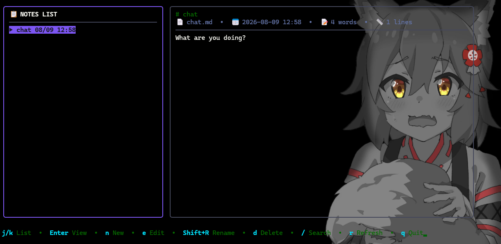

<div align="center">

# 📝 note-tui

**Simple text file note-taking application powered by Terminal UI (TUI) in Node.js**

[English](README.md) | [ภาษาไทย](README.th.md)



</div>

---

## ✨ Key Features

- 📁 **Plain Text Storage**: All notes are stored as `.md` or `.txt` text files in `./notes` (or a custom directory via `--dir`), making them readable by any editor, Git, or cloud sync service.
- 🎨 **Modern Sleek Interface**: Built with [Ink](https://github.com/vadimdemedes/ink) (React for CLIs) and a custom dark-mode theme.
- 🔍 **Real-time Live Search**: Press `/` to search and filter notes by title or content instantly.
- 📊 **Note Statistics**: Displays word count, line count, file size, and last modified date.
- ⌨️ **Keyboard Driven**: Efficient workflow with keyboard shortcuts for all actions.
- ✅ **Zero native dependencies**: No node-gyp, no Visual Studio builds — pure JavaScript.

---

## 🚀 Quick Start

> Requires [Node.js](https://nodejs.org/) **v22 or newer**. No other tools needed.

### 1. Run locally
```bash
npm install
npm start
```

### 2. Build a single-file bundle & sanity-check
```bash
npm run build   # bundles to dist/note-tui.mjs
```

### 3. Run tests
```bash
npm test
```

### 4. Install as a global command (optional)
```bash
npm link
note-tui
```

---

## ⌨️ Keyboard Shortcuts

| Mode | Key | Action |
|---|---|---|
| **List Mode** | `j` / `Down` | Move cursor down |
| | `k` / `Up` | Move cursor up |
| | `Enter` / `v` | View selected note |
| | `n` | Create new note |
| | `e` | Edit selected note |
| | `Shift+R` | Rename selected note |
| | `d` | Delete selected note (with confirmation prompt) |
| | `/` | Search & filter notes |
| | `r` | Refresh notes from disk |
| | `q` / `Ctrl+C` | Quit note-tui |
| **Edit Mode** | `Ctrl+S` | Save changes |
| | `Esc` | Cancel editing |
| | `Enter` | Insert new line |
| | `↑`/`↓`/`←`/`→` | Move cursor |
| | `Ctrl+Z` / `Ctrl+Y` | Undo / Redo |
| **Search Mode** | `Type text` | Filter notes in real-time |
| | `Esc` | Clear search filter |

---

## 📁 File Architecture

```
note-tui/
├── src/
│   ├── cli.jsx              # Entry point & CLI flag parsing (--dir, --version)
│   ├── app.jsx              # App state machine & keyboard-driven mode switching
│   ├── storage.js           # Text file reading/writing/deleting & searching
│   ├── styles.js            # Color palette / theme
│   ├── utils.js             # Text wrap, truncate & date formatting helpers
│   └── ui/
│       ├── Header.jsx       # Top app header bar
│       ├── Sidebar.jsx      # Notes list pane
│       ├── NoteView.jsx     # Note content viewer (scrollable)
│       ├── CreateForm.jsx   # New-note title form
│       ├── EditorPane.jsx   # Multi-line markdown editor (line numbers, undo)
│       ├── SearchBox.jsx    # Live search input
│       ├── DeleteView.jsx   # Delete confirmation
│       └── StatusBar.jsx    # Key hints & status toast
├── scripts/
│   └── run.mjs              # Dev launcher (transpiles JSX via esbuild)
├── tests/
│   ├── storage.test.js      # Storage unit tests
│   └── app.test.jsx         # UI smoke tests
├── img/
│   └── demo.png             # Demo preview screenshot
└── notes/                   # Storage directory for note text files
    ├── welcome.md
    └── shortcut-guide.md
```

---

## 📄 License
MIT License
