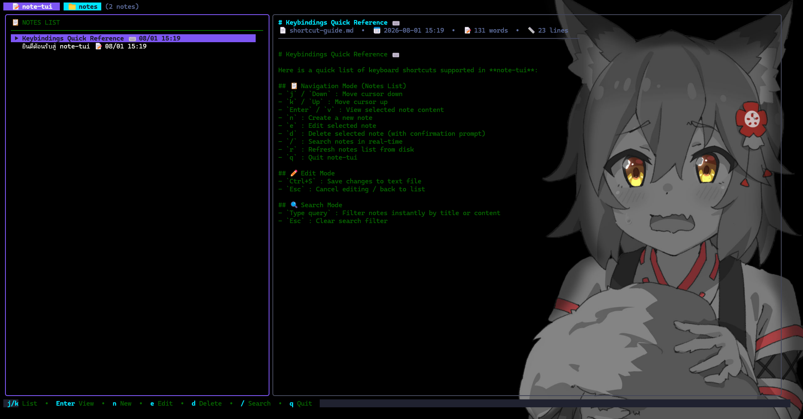

<div align="center">

# 📝 note-tui

**แอปพลิเคชันจดโน้ตแบบ Terminal UI (TUI) บันทึกเป็นไฟล์ข้อความ (Text Files)**

[English](README.md) | [ภาษาไทย](README.th.md)



</div>

---

## ✨ จุดเด่น / Features

- 📁 **บันทึกเป็นไฟล์ข้อความธรรมดา**: บันทึกโน้ตทุกตัวเป็นไฟล์ `.md` หรือ `.txt` ในโฟลเดอร์ `./notes` (หรือกำหนดผ่าน `--dir`) นำไปเปิดด้วยโปรแกรมใดก็ได้ หรือซิงค์ผ่าน Git/Cloud ได้ทันที
- 🎨 **Modern Sleek Interface**: ดีไซน์สวยงามด้วย [Charm Bubble Tea](https://github.com/charmbracelet/bubbletea) และ [Lip Gloss](https://github.com/charmbracelet/lipgloss) ธีม Dark Mode พร้อมรองรับภาษาไทย
- 🔍 **Real-time Live Search**: กด `/` เพื่อค้นหาข้อความภายในเนื้อหาโน้ตหรือชื่อไฟล์ได้ทันที
- 📊 **สถิติโน้ต**: แสดงจำนวนคำ (Word Count), จำนวนบรรทัด (Line Count), เวลาที่แก้ไขล่าสุด และขนาดไฟล์
- ⌨️ **Keyboard Driven**: ทำงานรวดเร็วผ่านแป้นพิมพ์ทั้งหมด

---

## 🚀 วิธีการใช้งาน

### 1. รันผ่าน `go run`
```bash
go run main.go
```

### 2. กำหนดโฟลเดอร์บันทึกโน้ตเอง (`--dir`)
```bash
go run main.go --dir "D:\MyNotes"
```

### 3. Build เป็น Executable
```bash
go build -o note-tui.exe .
./note-tui.exe
```

---

## ⌨️ ปุ่มลัด (Keyboard Shortcuts)

| Mode | Key | Action |
|---|---|---|
| **List Mode** | `j` / `Down` | เลื่อนลง (Next note) |
| | `k` / `Up` | เลื่อนขึ้น (Previous note) |
| | `Enter` / `v` | อ่านโน้ตที่เลือก (View note) |
| | `n` | สร้างโน้ตใหม่ (New note) |
| | `e` | แก้ไขโน้ตที่เลือก (Edit note) |
| | `d` | ลบโน้ต (Delete note with confirmation) |
| | `/` | ค้นหาโน้ต (Search & Filter) |
| | `r` | โหลดรายการโน้ตใหม่จากดิสก์ (Refresh) |
| | `q` / `Ctrl+C` | ออกจากโปรแกรม (Quit) |
| **Edit Mode** | `Ctrl+S` | บันทึกการแก้ไข (Save note) |
| | `Esc` | ยกเลิกการแก้ไข (Cancel edit) |
| **Search Mode** | `Type text` | พิมพ์คำค้นหา |
| | `Esc` | ล้างคำค้นหา (Clear search) |

---

## 📁 โครงสร้างโปรเจกต์

```
note-tui/
├── main.go               # Entry point และ CLI flag parsing
├── storage/
│   ├── storage.go        # ระบบอ่าน/เขียน/ลบ/ค้นหาไฟล์ข้อความ (.md / .txt)
│   └── storage_test.go   # Unit test ระบบจัดเก็บไฟล์
├── ui/
│   ├── model.go          # Bubble Tea state management และ interactive logic
│   └── styles.go         # Lip Gloss theme, colors, และ layout borders
├── img/
│   └── demo.png          # รูปพรีวิวตัวอย่างแอปพลิเคชัน
└── notes/                # โฟลเดอร์เก็บไฟล์โน้ตจริง
    ├── welcome.md
    └── shortcut-guide.md
```

---

## 📄 License
MIT License
